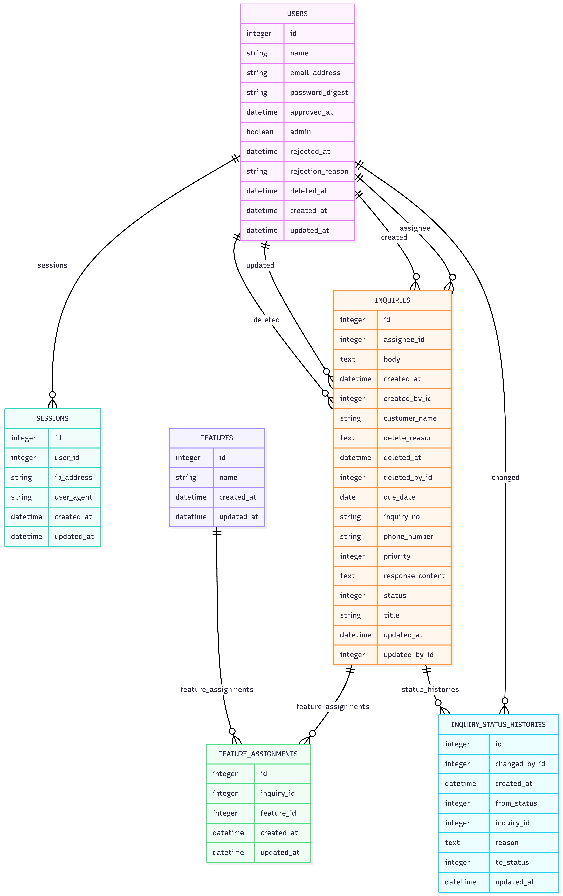

# SupportLog

## はじめに

SupportLog は、社内の問い合わせ対応を効率化するために開発した問い合わせ管理アプリです。

カスタマーサポート業務では、問い合わせ内容・対応状況・担当者・対応履歴が複数の場所に分散しやすく、対応漏れや引き継ぎミスが発生しやすい課題があります。

本アプリでは、問い合わせの登録から対応状況の管理、ステータス変更履歴、ユーザー承認、論理削除までを一元管理できるようにしました。

ポートフォリオとしては、単なるCRUDアプリではなく、実際の業務運用を想定した「承認制」「履歴管理」「論理削除」「権限制御」「GitHub ActionsによるCI」まで実装している点を重視しています。

---

## コンセプト・概要

### コンセプト

**カスタマーサポートの現場で使える、問い合わせ対応の見える化ツール**

SupportLog は、問い合わせを登録して終わりではなく、以下のような実務上必要になる情報を残せることを意識して設計しています。

- 誰が問い合わせを登録したか
- 誰が担当しているか
- 現在どのステータスか
- ステータスを変更した理由は何か
- 誰が更新・削除したか
- 削除済みユーザーが担当していた問い合わせ履歴をどう残すか

### アプリ概要

SupportLog は、社内向けの問い合わせ管理アプリです。

主な利用者は、カスタマーサポート担当者や社内管理者を想定しています。

問い合わせ内容、対応内容、事業者情報、電話番号、機能分類、優先度、ステータス、登録者、更新者、担当者などを管理できます。

---

## 開発環境・使用技術

### バックエンド

- Ruby 3.3.2
- Ruby on Rails 8.1.3
- SQLite3
- Rails 8 Authentication

### フロントエンド

- ERB
- HTML
- CSS
- application.css による独自スタイリング

### テスト・品質管理

- Minitest
- RuboCop
- GitHub Actions
  - scan_ruby
  - scan_js
  - lint
  - test
  - system-test

### 開発・管理

- Git
- GitHub
- Pull Request運用
- GitHub ActionsによるCI確認後にmainへマージ

---

## 機能一覧

### ユーザー機能

- ユーザー登録
- ログイン / ログアウト
- パスワード再設定
- 管理者によるユーザー承認
- 管理者によるユーザー却下
- 管理者によるユーザー削除
- 承認済みユーザーのみログイン可能
- 管理者のみユーザー一覧を閲覧可能
- 削除済みユーザーの論理削除
- 削除済みユーザーの再登録時の復活処理

### 問い合わせ管理機能

- 問い合わせ一覧表示
- 問い合わせ詳細表示
- 問い合わせ登録
- 問い合わせ編集
- 問い合わせ論理削除
- 問い合わせNoの自動採番
- 事業者名の管理
- 電話番号の管理
- 問い合わせ内容の管理
- 対応内容の管理
- 機能の複数選択
  - パソコン
  - タブレット
- 優先度管理
  - 障害
  - 高
  - 中
  - 低
- ステータス管理
  - 未対応
  - 対応中
  - 完了
- 担当者の自動設定
  - 問い合わせ登録時にログイン中ユーザーを担当者として自動設定

### 履歴・監査機能

- ステータス変更履歴の記録
- ステータス変更理由の必須化
- ステータス変更者の記録
- 問い合わせ更新者の記録
- 問い合わせ削除者の記録
- 登録者・登録日・更新者・更新日の表示
- 削除済みユーザーの担当履歴表示
  - 例：`テストユーザー1（削除ユーザー）`

### UI機能

- 問い合わせ一覧のテーブル表示
- ステータスバッジ表示
- 優先度バッジ表示
- 詳細画面のカード型レイアウト
- 編集画面の管理情報表示
- 日本語バリデーションメッセージ対応

---

## ER図



---

## 注意事項

本アプリは、ポートフォリオ用途として開発している社内向け問い合わせ管理アプリです。

現時点では、ユーザーの承認・却下・削除に関する通知処理は、メールの実送信ではなく、画面上での確認を前提としています。  
今後、Action Mailer などを利用したメール通知機能の実装を予定しています。

また、問い合わせやユーザーの削除については、業務上の履歴を保持するため、物理削除ではなく論理削除を採用しています。

削除済みユーザーが過去に担当していた問い合わせについては、担当者欄に以下のように表示されます。

```text
ユーザー名（削除ユーザー）
```

これにより、ユーザー削除後も過去の問い合わせ対応履歴が失われず、誰が対応していたのかを確認できる設計にしています。

---

## 工夫したところ

### 1. 実務を想定した問い合わせ管理

単純なCRUD機能にとどまらず、実際のカスタマーサポート業務で必要になる情報を管理できるように設計しました。

問い合わせ内容だけでなく、対応状況、優先度、対応内容、事業者情報、担当者、登録者、更新者、ステータス変更履歴まで記録できるようにしています。

カスタマーサポート業務では、問い合わせの「現在の状態」だけでなく、「なぜその状態になったのか」を残すことが重要です。  
そのため、ステータスを変更する際には変更理由の入力を必須にし、対応経緯を後から確認できるようにしました。

### 2. 担当者を手入力させず、ログインユーザーを自動設定

問い合わせ登録時、担当者をフォームで選択するのではなく、ログイン中のユーザーを担当者として自動設定する仕組みにしています。

これにより、担当者の選択ミスを防ぎ、誰が問い合わせを登録・担当したのかを自然に記録できるようにしました。

また、担当者を画面上で自由に変更できないようにすることで、データの信頼性を保つ設計にしています。

### 3. ステータス変更履歴の実装

問い合わせのステータスが変更された場合のみ、変更前ステータス、変更後ステータス、変更理由、変更者を履歴として保存しています。

これにより、問い合わせが「未対応」から「対応中」、または「完了」へ変わった経緯を後から確認できます。

実務では、対応の引き継ぎや過去対応の確認が必要になる場面が多いため、履歴を残すことで属人化を防ぎ、チームでの対応を想定した設計にしました。

### 4. ユーザー削除後も問い合わせ履歴を保持

ユーザーを削除しても、過去の問い合わせ担当者情報が失われないように、ユーザー削除には論理削除を採用しています。

削除済みユーザーが担当していた問い合わせでは、担当者欄に以下のように表示されます。

```text
ユーザー名（削除ユーザー）
```

これにより、退職者や利用停止ユーザーが過去に担当していた問い合わせでも、履歴として分かりやすく確認できます。

### 5. 管理者承認制の導入

ユーザー登録後、すぐにログインできるのではなく、管理者が承認したユーザーのみログインできる仕組みにしています。

社内向け業務アプリでは、不特定のユーザーが自由に利用できてしまうと情報管理上のリスクがあります。  
そのため、管理者による承認制を導入し、利用できるユーザーを制御できるようにしました。

また、却下されたユーザーや未承認ユーザーはログインできないようにし、業務アプリとしての安全性を意識しています。

### 6. 日本語表示・バリデーションメッセージの整備

Rails標準の英語表記のままでは、実際の業務画面として分かりにくいため、画面表示やバリデーションメッセージを日本語化しました。

例：

```text
Titleを入力してください
↓
タイトルを入力して下さい
```

```text
Bodyを入力してください
↓
問い合わせ内容を入力して下さい
```

```text
Featuresを1つ以上選択してください
↓
機能を1つ以上選択してください
```

利用者が迷わず操作できるよう、エラーメッセージも実際の画面項目名に合わせて調整しています。

### 7. GitHub Actionsによる品質確認

Pull Requestを作成し、GitHub Actionsのチェックを通過してからmainブランチへマージする運用にしました。

実行している主なチェックは以下です。

- Rubyのセキュリティチェック
- JavaScriptのチェック
- RuboCopによるコード解析
- 自動テスト
- system test

個人開発であっても、実務に近い開発フローを意識し、テストと静的解析を通してからmainへ反映するようにしています。

### 8. ポートフォリオとして伝わる画面設計

単に機能を実装するだけでなく、評価者が画面を見たときに内容を理解しやすいように、一覧画面・詳細画面・編集画面のレイアウトも整えました。

問い合わせ一覧では、ステータスや優先度を視認しやすいようにバッジ表示を採用しています。  
詳細画面では、問い合わせ情報と管理情報を整理して表示し、業務アプリとして見やすい構成を意識しました。

---

## 今後実装予定の機能

### 1. 問い合わせ検索・絞り込み機能

問い合わせNo、事業者名、ステータス、優先度、担当者、機能などで検索・絞り込みできる機能を追加予定です。

問い合わせ件数が増えた場合でも、必要な問い合わせを素早く探せるようにすることで、実務での使いやすさを向上させます。

### 2. 削除済み問い合わせの管理画面

現在、問い合わせは論理削除で管理しています。

今後は、削除済み問い合わせを管理者のみ確認できる画面を作成し、削除理由・削除者・削除日時を確認できるようにします。

これにより、誤削除の確認や監査目的での履歴確認にも対応できるようにします。

### 3. ダッシュボード機能

未対応件数、対応中件数、完了件数、優先度別件数などを可視化するダッシュボードを追加予定です。

問い合わせの状況を一覧で把握できるようにすることで、管理者が対応状況を確認しやすい画面を目指します。

### 4. CSV出力機能

問い合わせ一覧や対応履歴をCSVで出力できる機能を追加予定です。

業務報告、対応件数の集計、問い合わせ傾向の分析などに活用できるようにします。

### 5. 添付ファイル機能

問い合わせに画像や資料を添付できる機能を追加予定です。

スクリーンショットや関連資料を問い合わせと一緒に管理できるようにすることで、より実務に近い問い合わせ管理を実現します。
